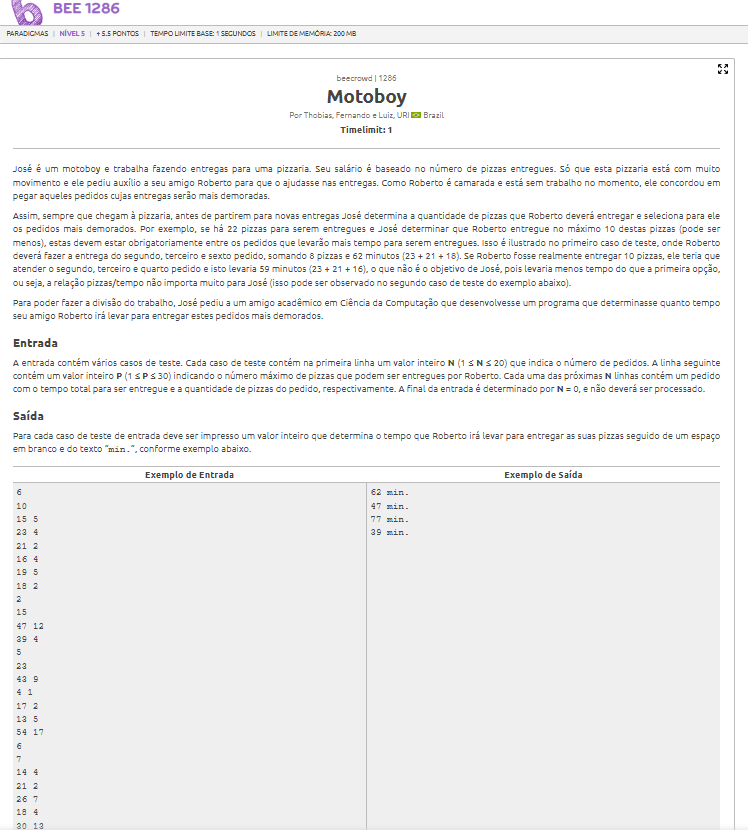
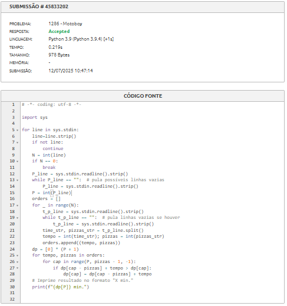

# A questão

# Estratégia:

Ordenar os pedidos pelo tempo de entrega e selecionar os primeiros até atingir o limite de P pizzas sendo necessário testar combinações aleatórias de pedidos que caibam dentro do limite.O problema dessas abordagens é que elas não garantem o melhor resultado, um único pedido com tempo alto pode consumir muitas pizzas, impedindo que outros pedidos também com bom tempo sejam escolhidos. Isso pode levar a um total menor do que o possível.
Por isso, é importante considerar todas as combinações viáveis de pedidos dentro do limite de P pizzas

Capacidade da mochila = número máximo de pizzas (P) sendo que cada pedido tem:

1. Peso = número de pizzas requisitadas.

2. Valor = tempo de entrega associado.

Objetivo: maximizar o tempo total, sem ultrapassar a quantidade de pizzas disponível.

# Algoritmo utilizado
Programação Dinâmica baseada na abordagem da Mochila:
Definimos o tempo máximo possível usando os primeiros pedidos com até n pizzas.

Para cada pedido, temos duas opções:

1. Não incluir o pedido

2. Incluir o pedido (se couber)

# Resultado
O algoritmo atinge o resultado necessário para ser aceito

