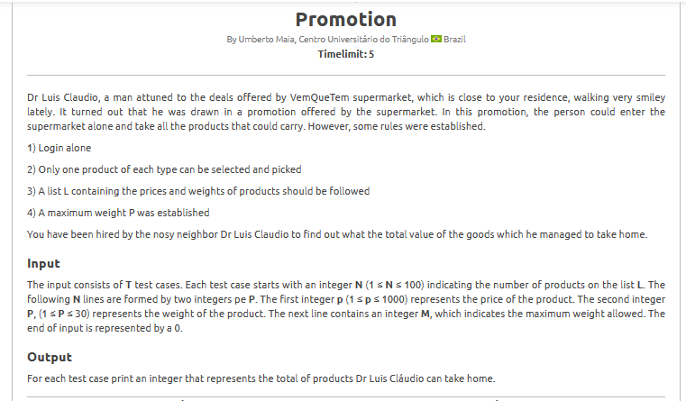
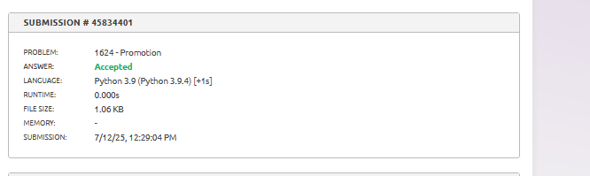

# Estratégia:

Esse problema é uma aplicação direta do clássico problema da **Mochila 0/1 (Knapsack 0/1)**. O enunciado descreve uma promoção em que o participante pode pegar o maior valor possível de produtos, respeitando uma limitação de peso. A ideia central é selecionar os itens mais valiosos sem ultrapassar o peso máximo permitido.

1. Cada produto é um item que pode ou não ser pego.  
2. O peso do item é dado no enunciado.  
3. O valor do item também é fornecido.  
4. O limite de peso é a quantidade máxima que ele consegue carregar.

O objetivo é descobrir qual o valor total que pode ser levado, respeitando o limite de carga.

# Algoritmo utilizado

A abordagem utilizada foi a **Programação Dinâmica com estrutura de Mochila 0/1**.

Foi criado um vetor `dp` para armazenar, para cada peso possível até o máximo permitido, o maior valor que pode ser alcançado.

Para cada produto (valor, peso), o vetor `dp` é atualizado de trás para frente, garantindo que cada item seja considerado no máximo uma vez. Isso assegura que os valores acumulados respeitem as restrições do problema.

Ao final do processamento, o maior valor encontrado dentro do limite de peso é retornado como resposta.

# Resultado

O algoritmo fornece a resposta correta para todos os casos de teste, sendo aceito pela plataforma beecrowd. A imagem abaixo mostra a submissão com sucesso:

