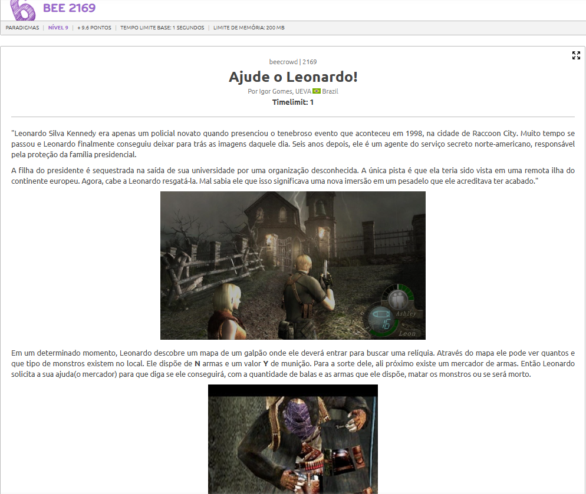

# A questão

# Estratégia:

O problema é uma versão do problema da Mochila 0/1 (Knapsack 0/1), em que:

1. Cada arma representa um item que pode ou não ser incluído.

2. O peso do item é o número de balas que a arma consome (ela sempre consome todas).

3. O valor do item é o dano total que a arma pode causar (potência por bala × número de balas).

4. O limite de capacidade é o total de balas que Leon pode carregar.

O objetivo é verificar se, com até aquele número de balas, é possível causar dano total maior ou igual à soma das resistências dos monstros.

# Algoritmo utilizado
Utilizamos Programação Dinâmica (Mochila 0/1), com a seguinte abordagem:

Definimos um vetor que representa o máximo dano possível com exatamente i balas.

Para cada arma (munição, dano_total): Percorremos o vetor pela munição e dano total

Após processar todas as armas, percorremos o vetor dp e verificamos se existe algum valor de dano tal que dano seja maior que dano_necessario.

# Resultado
O algoritmo atinge o resultado necessário para ser aceito porém por algum critério de retorno não explicito ele retorna presentation error, foi gerado o arquivo input.txt para verificação das entradas iniciais cedidaas pelo beecrowd no qual ele da o output requerido, se quiser rodar basta clonar o repositorio entrar na pasta beecrowd-2169-ajude-leo e rodar o seguinte comando:

py 2169_ajude_leo.py < input.txt

ou

python3 2169_ajude_leo.py < input.txt

a depender de sua versão

